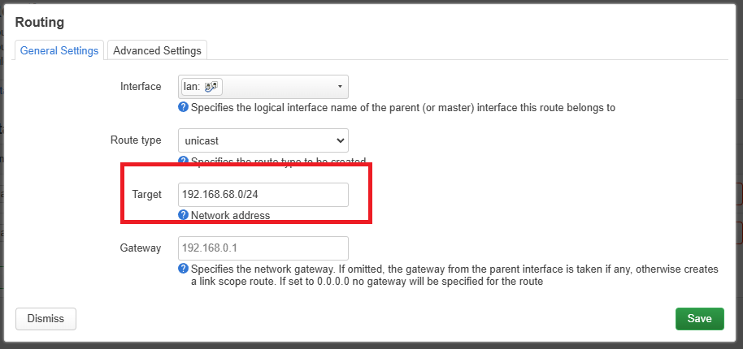

# [MetalLB](https://metallb.io/)

Kubernetes does not offer an implementation of network load balancers (Services of type LoadBalancer) for bare-metal clusters. The implementations of network load balancers that Kubernetes does ship with are all glue code that calls out to various IaaS platforms (GCP, AWS, Azure…). If you’re not running on a supported IaaS platform (GCP, AWS, Azure…), LoadBalancers will remain in the **“pending”** state indefinitely when created.

## Enable strict ARP mode

If you’re using kube-proxy in IPVS mode, since Kubernetes v1.14.2 you have to enable strict ARP mode.

Note, you don’t need this if you’re using kube-router as service-proxy because it is enabling strict ARP by default.

```bash
# see what changes would be made, returns nonzero returncode if different
kubectl get configmap kube-proxy -n kube-system -o yaml | \
sed -e "s/strictARP: false/strictARP: true/" | \
kubectl diff -f - -n kube-system

# actually apply the changes, returns nonzero returncode on errors only
kubectl get configmap kube-proxy -n kube-system -o yaml | \
sed -e "s/strictARP: false/strictARP: true/" | \
kubectl apply -f - -n kube-system
```

## Installation by manifest

```bash
kubectl apply -f https://raw.githubusercontent.com/metallb/metallb/v0.14.9/config/manifests/metallb-native.yaml

# verify
kubectl -o wide get pods -n metallb-system

# Output should be similar to following:
[onme@rhel9-1 kubernetes]$ kubectl -o wide get pods -n metallb-system
NAME                         READY   STATUS    RESTARTS   AGE     IP              NODE          NOMINATED NODE   READINESS GATES
controller-bb5f47665-5fvp8   1/1     Running   0          2m10s   10.222.191.67   rhel9-3.zzz   <none>           <none>
speaker-7dggh                1/1     Running   0          2m10s   192.168.6.91    rhel9-1.zzz   <none>           <none>
speaker-7jqtv                1/1     Running   0          2m10s   192.168.6.93    rhel9-3.zzz   <none>           <none>
speaker-926ws                1/1     Running   0          2m10s   192.168.6.92    rhel9-2.zzz   <none>           <none>

```

## Installation with Helm

```bash
helm repo add metallb https://metallb.github.io/metallb
helm install metallb metallb/metallb
```

## Layer 2 configuration

Layer 2 mode is the simplest to configure: in many cases, you don’t need any protocol-specific configuration, only IP addresses. Use a different subnet other than your lan in file **"metal-l2-range-allocation.yaml"**

```bash
kubectl create -f metal-l2-range-allocation.yaml
```

## Add static route on your router

Here use OpenWRT router firmware as example

