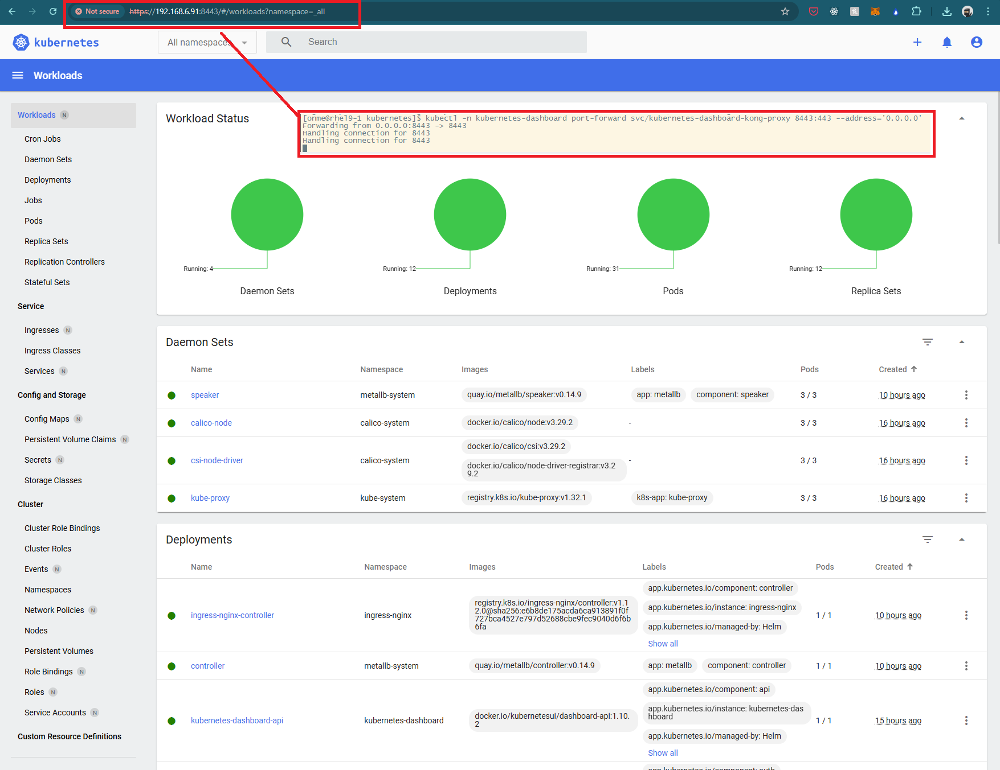

# [Kubernetes Dashboard](https://kubernetes.io/docs/tasks/access-application-cluster/web-ui-dashboard/)

Kubernetes Dashboard supports only Helm-based installation

## Install Helm

See 02-helm.md for instructions

## Deploying the Dashboard UI

```bash
# Add kubernetes-dashboard repository
helm repo add kubernetes-dashboard https://kubernetes.github.io/dashboard/
# Deploy a Helm Release named "kubernetes-dashboard" using the kubernetes-dashboard chart
helm upgrade --install kubernetes-dashboard kubernetes-dashboard/kubernetes-dashboard --create-namespace --namespace kubernetes-dashboard
```

## Create a user with admin privileges

To protect your cluster data, Dashboard deploys with a minimal RBAC configuration by default. Currently, Dashboard only supports logging in with a Bearer Token.

```bash
kubectl apply -f admin-user.yaml
kubectl apply -f admin-user-role-binding.yaml
kubectl -n kubernetes-dashboard create token admin-user --duration=8760h > token.txt
```

Save the content of **token.txt** for later use.

## Accessing the Dashboard UI

* Command line proxy for temperary access

```bash
kubectl -n kubernetes-dashboard port-forward svc/kubernetes-dashboard-kong-proxy 8443:443 --address='0.0.0.0'
```

* Open a brower and access <https://lan-ip-of-the-node:8443>, copy and paste the token from previous generated **token.txt**

For permanent access, suggests explosing via ingress which discussed in 10-nginx-ingress.md


