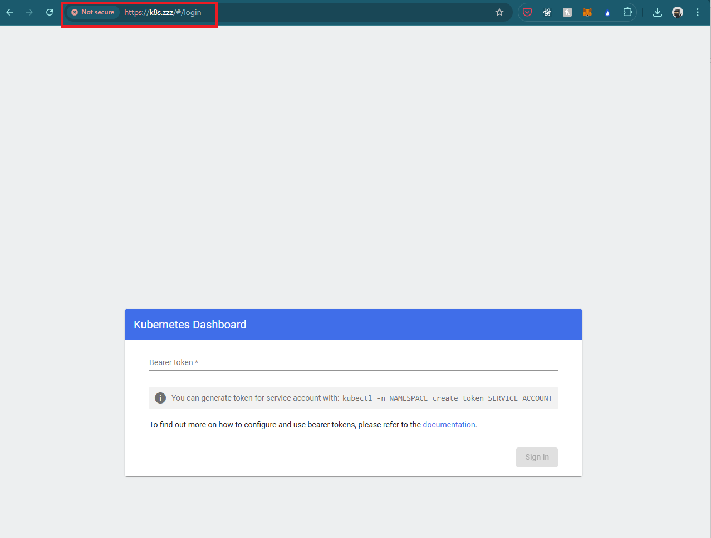

# [NGINX Ingress Controller](https://docs.nginx.com/nginx-ingress-controller/)

## Install Helm

See 02-helm.md for instructions

## Install via helm

```bash
helm upgrade --install ingress-nginx ingress-nginx \
  --repo https://kubernetes.github.io/ingress-nginx \
  --namespace ingress-nginx --create-namespace

# If you got MetalLB installed, check the service will show follwing (EXTERNAL-IP has a value):
[onme@rhel9-1 kubernetes]$ kubectl get svc -n ingress-nginx
NAME                                 TYPE           CLUSTER-IP     EXTERNAL-IP    PORT(S)                      AGE
ingress-nginx-controller             LoadBalancer   10.104.49.27   192.168.68.1   80:30569/TCP,443:30752/TCP   81s
ingress-nginx-controller-admission   ClusterIP      10.97.109.96   <none>         443/TCP                      81s

```

## Try to expose Kubernetes Dashboard via Ingress

```bash
kubectl create -f ingress_kong_k8s.zzz.yaml

kubectl get ingress --all-namespaces
# Output should be similar to following:
NAMESPACE              NAME            CLASS   HOSTS     ADDRESS   PORTS   AGE
kubernetes-dashboard   k8s-dashboard   nginx   k8s.zzz             80      25s
```

Add **k8s.zzz** to 192.168.68.1 to your local **hosts** file or DNS record on router. Visit <https://k8s.zzz/> is another way to access the dashboard.

